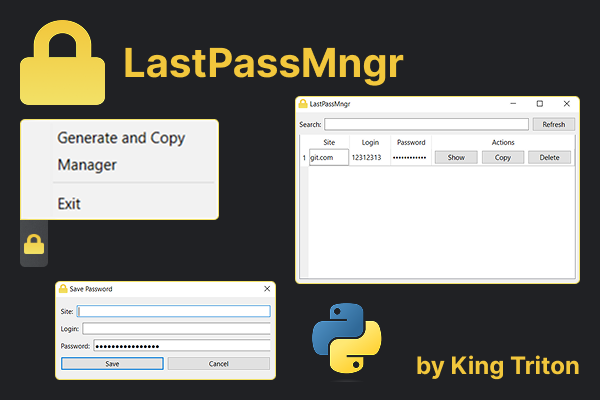

<p align="center">
  
</p>

# LastPassMngr



Простой офлайн-менеджер паролей с возможностью генерации, сохранения и шифрования паролей.  
Проект создан **для личного использования**, однако может быть полезен всем, кто хочет иметь локальный инструмент для безопасного хранения паролей без облачных сервисов.

---

## Основные возможности

- Генерация случайных и усиленных паролей.
- Шифрование данных с использованием библиотеки **cryptography (Fernet + PBKDF2HMAC)**.
- Хранение зашифрованных паролей локально в `Documents/LastPassMngr/passwords.enc`.
- Защита хранилища мастер-паролем.
- Управление паролями через графический интерфейс на **PyQt6**.
- Копирование паролей в буфер обмена.
- Быстрый доступ через иконку в **системном трее**.
- Возможность смены мастер-пароля без потери данных.

---

## Структура проекта

```

LastPassMngr/
├── app.py                      # Точка входа приложения
├── crypto_manager.py           # Работа с шифрованием и хранилищем
├── manager_window.py           # Главное окно менеджера паролей
├── master_password_dialog.py   # Окно ввода/создания мастер-пароля
├── password_generator.py       # Генератор паролей
├── save_dialog.py              # Окно сохранения пароля
├── Logo.ico                    # Иконка приложения (используется в трее)
└── README.md

````

---

## Используемые технологии

- **Python 3.10+**
- **PyQt6**
- **cryptography**
- **pyperclip**

---

## Установка и запуск

1. Клонировать репозиторий:
   ```bash
   git clone https://github.com/king-tri-ton/LastPassMngr.git
   cd LastPassMngr
````

2. Установить зависимости:

   ```bash
   pip install -r requirements.txt
   ```

3. Запустить:

   ```bash
   python app.py
   ```

---

## Как работает

* При первом запуске приложение предложит создать **мастер-пароль** — он будет использоваться для шифрования всех данных.
* Все пароли хранятся в зашифрованном виде в директории:

  ```
  C:\Users\<Имя>\Documents\LastPassMngr\
  ```
* После входа в трее появится иконка приложения.
  Через неё можно:

  * Сгенерировать новый пароль (он автоматически копируется в буфер обмена);
  * Открыть окно менеджера для просмотра, поиска и удаления паролей.

---

## Лицензия

Проект распространяется под лицензией **MIT**.
Автор и разработчик: **Михаил (t.me/king_triton)**
Иконка **Logo.ico** создана лично мной и используется с разрешения.
